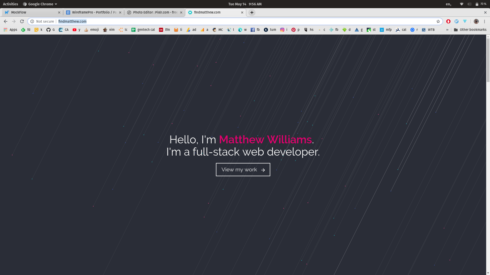

# Carlie Hamilton's Portfolio

- Deployed Website - [carlie.netlify.com](https://carliehamilton.netlify.com/)
- [Github Profile](https://github.com/BlueCodeThree/Carlie-Portfolio)

## ℹ️ About This Website

### Purpose
### Functionality / features
### Sitemap
### Screenshots
### Target audience
### Tech stack (e.g. html, css, deployment platform, etc)

## 🖌 Design

### Design process

My initial ideas for the website were:

- One column design - desktop mode possibly having a sidebar navigation
- [Parallax image](https://alligator.io/css/pure-css-parallax/) at the top of the site (below navigation)
- One page design for the most part, but with a link to show more projects (all projects to be on a separate page).
- Navy blue background, with hot pink highlights/accents on the page.
- The overall website having a professional feel but also unique and stand out with the colour pallet.

I am influenced by the structure of [Matthew William's website](http://findmatthew.com/)

I also really like the idea of incorporating a game on the page like on [Rafael Caferati's website](https://caferati.me/)

On his page he has some kind of craft/robot that can shoot things to destroy the page. I know it is an extra extra stretch goal, but I would love to try to convert my ruby snake game to javascript and have that eat my main page. This is a super stretch goal to implement in the future.

#### Mood Board

I chose navy blue because it is my favourite colour and hot pink because that is the colour of my jumper. I like to stand out in photos with my bright hot pink jumper, it has become a bit of a signature colour for me.

Because pink is a really bright colour, I thought it would be better in small doses. I added a green colour incase I needed it, and an offwhite colour as well.

I wanted sans serif fonts for easy readability on the screen. I wanted a mono space font for special highlighting, maybe for image captions. I chose two other sans serif fonts for headers and general text.

### Wireframes

(Click to enlarge)

In my wireframes I have created a layout for mobile as well as a larger version for desktop and tablet. I have an almost one page design with a separate page to expand on my portfolio items.

### Logo

I wanted a simple logo/image to put on the website that would represent being a developer, and allow the page to have a common element that I could also use as a favicon. I found this by [freepik on flaticon.com:](https://www.freepik.com/?__hstc=57440181.cb32c4642b4100318fd2c153520c6b27.1557789566265.1557789566265.1557789566265.1&__hssc=57440181.1.1557789566266&__hsfp=4071572874)

### Usability considerations

## 🔍 Planning
### Project plan & timeline

#### Pre Project

- mood boarding and wire frame brain storming, trello board setup

#### Day One - Tuesday, 14 May 2019

I completed my mood board and wire frames and began working on my content and HTML. I have a functional hamburger menu for the moment.

I am already thinking that I will be changing slightly from my wireframes for the mobile. Instead of the content inside boxes, having the content go across 100% of the screen and change the background colours of each slighty. I am undecided on the colours, if I want to do slightly different blue colours (similar colours), or have the colours contrasting.

End of day trello board:

#### Day Two - Wednesday 15 May 2019

On day two I finished the most of the mobile layout, added a css animation to my main button, and made the main navigation work in desktop/tablet mode. 

#### Weekend 

I continued to work on my website. I have changed my secondary blue colour so that it is more accessible, and have decided to put the whole website on one page instead of a seperate page for my projects. This way the webpage will also be easier to update and maintain. 

## 🕸 Short Answer Q&A
 - Include short answers to the following questions,
 - Describe key events in the development of the internet from the 1980s to today (max. 150 words)
 - Define and describes the relationship between fundamental aspects of the internet such as: domains, web servers, DNS, and web browsers (max. 150 words)
 - Reflect on one aspect of the development of internet technologies and how it has contributed to the world today (max. 150 words)
